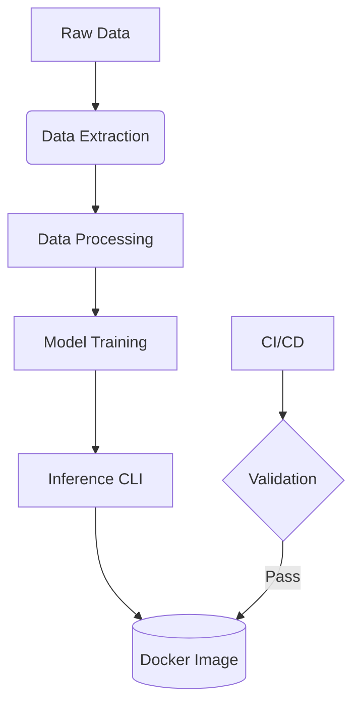

# BERT Sentiment Analysis Pipeline

[](https://github.com/OusmaneMomboMombo/sentiment-analysis-bert/actions)
[](https://hub.docker.com/r/ousmanemombo/sentiment-analysis)
[](https://www.python.org/downloads/release/python-390/)

End-to-end MLOps pipeline for sentiment classification using BERT, featuring containerized deployment and automated CI/CD workflows.

## Key Features
- **Preprocessing Pipeline**: Text cleaning and BERT-specific tokenization
- **Model Training**: Fine-tuning with PyTorch and HuggingFace Transformers
- **CLI Interface**: Interactive and batch prediction modes
- **Containerized Deployment**: Docker support with volume mounting
- **CI/CD Automation**: GitHub Actions for testing, evaluation, and Docker builds

## Technical Architecture


## Getting Started

### Prerequisites
- Python 3.9+
- Docker (for container deployment)
- Git LFS (if tracking model files)

### Installation
```bash
# Clone repository (include LFS if needed)
git clone https://github.com/OusmaneMomboMombo/sentiment-analysis-bert.git
cd sentiment-analysis-bert

# Set up virtual environment
python -m venv .venv
source .venv/bin/activate  # Linux/MacOS
.\.venv\Scripts\activate   # Windows

# Install dependencies
pip install -r requirements.txt
```

## Usage

### Training Pipeline
1. Place your dataset in `data/` directory (default expects `dataset.csv`)
2. Run training:
```bash
python src/model.py --epochs 3 --batch_size 32
```

### Inference Options
#### CLI Mode
```bash
# Single prediction
python src/inference.py "Your text here"

# Interactive mode
python src/inference.py
> Enter text (or 'exit'): 
```

#### Docker Deployment
```bash
# Build with mounted volume for models
docker build -t sentiment-analysis .
docker run -v ./saved_models:/app/saved_models sentiment-analysis "Sample text"
```

## Project Structure
```
├── .github/
│   └── workflows/        # CI/CD pipelines
│       ├── test.yml      # Unit/integration tests
│       ├── evaluate.yml  # Model validation
│       └── build.yml     # Docker image builder
├── src/
│   ├── data_extraction.py  # Data loader with error handling
│   ├── data_processing.py  # Text cleaning/tokenization
│   ├── model.py            # BERT fine-tuning
│   └── inference.py        # Prediction interface
├── tests/
│   └── unit/               # Comprehensive test suite
├── saved_models/           # Model storage (.gitignored)
├── requirements.txt        # Dependencies
└── docker-compose.yml      # Service definition
```

## CI/CD Workflows
| Workflow | Trigger | Actions |
|----------|---------|---------|
| **Test** | Push/PR | - Unit tests<br>- Code quality checks |
| **Evaluate** | Post-test | - Model validation<br>- Metric tracking |
| **Build** | Post-evaluation | - Docker image build<br>- Registry push |

## Team Contributions
| Member | Key Responsibilities |
|--------|----------------------|
| Ousmane MOMBO MOMBO | - Data pipeline architecture<br>- Docker configuration<br>- CI/CD setup |
| Nathan REGOMBY | - BERT model implementation<br>- Training logic<br>- Test suite |


